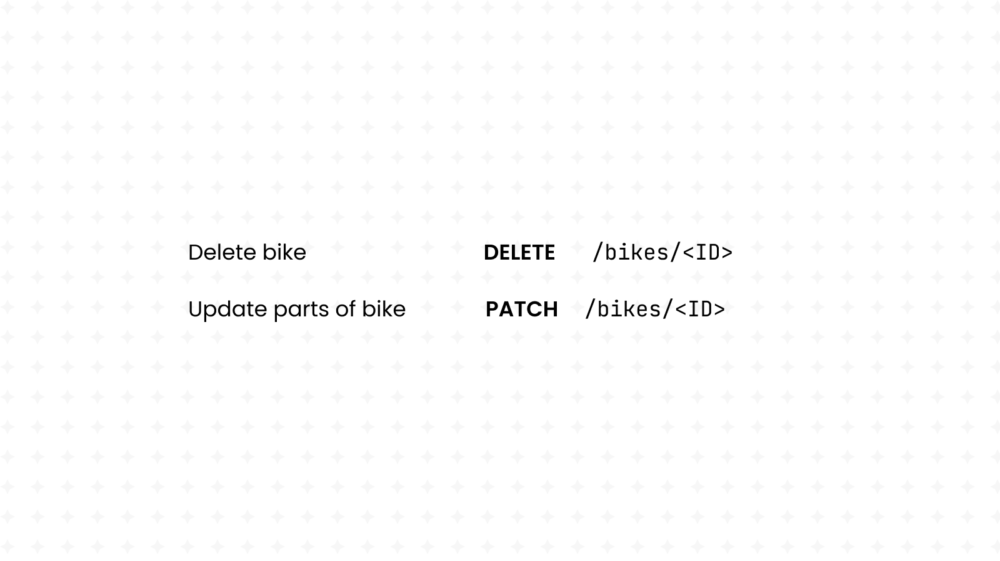

# Finishing up with routes to update and delete data



We’re almost done; but we still must implement two more route handlers: PATCH and DELETE.

The former allows clients to update only *parts* of a bike item, as opposed to PUT which always replaces the whole thing. The latter is quite self-explanatory and it simply deletes the item in demand.

## Updating parts of a bike item

As always, we’ll of course get started by extracting data from the HTTP request:

```javascript
// Patch bike if it exists
router.patch("/:id", async (req, res) => {
  const bikeId = req.params.id;
  const newData = req.body || {};
});
```

[Link to full code.](https://github.com/eludadev/bikes-api/blob/main/router.js)

Next step is to check whether or not a bike item with this ID exists, before we update anything.

```javascript
// Patch bike if it exists
router.patch("/:id", async (req, res) => {
  const bikeId = req.params.id;
  const newData = req.body || {};

  try {
    const { props: oldBike } = await bikesCollection.get(bikeId);
  } catch (e) {
    console.log(`PATH /bikes/${bikeId}`, e.message);
    res.sendStatus(404);
  }
});
```

[Link to full code.](https://github.com/eludadev/bikes-api/blob/main/router.js)

After that, we may take advantage of DynamoDB’s [UpdateItem](https://docs.aws.amazon.com/amazondynamodb/latest/APIReference/API_UpdateItem.html) command to only replace parts of our bike item:

```javascript
// Save new bike object
await bikesCollection.set(bikeId, newData);
```

[Link to full code.](https://github.com/eludadev/bikes-api/blob/main/router.js)

Let’s finish up by sending the full bike object back to the client. We’ll take advantage of JavaScript [Spread Syntax](https://developer.mozilla.org/en-US/docs/Web/JavaScript/Reference/Operators/Spread_syntax) to create that object:

```javascript
const bike = {
  ...oldBike,
  ...newData,
};

res.send(bike);
```

[Link to full code.](https://github.com/eludadev/bikes-api/blob/main/router.js)

And again, let’s try it out:

```json
// request.json (remove this line from the actual file!)
{
  "totalInventory": 4,
  "availableForSale": true
}
```

```bash
curl -X PATCH -H "Content-Type: application/json" http://localhost:3000/bikes/<ID> -d @request.json | jq . # replace <ID> with an ID from the response to /all
```

## Deleting a bike item

It wouldn’t be a big stretch to say that this is the simplest route of the bunch.

First step is to get the ID from the route parameters:

```javascript
// Delete bike if it exists
router.delete("/:id", async (req, res) => {
  const bikeId = req.params.id;
});
```

[Link to full code.](https://github.com/eludadev/bikes-api/blob/main/router.js)

Following that, we quite simply call one function from Cyclic’s DynamoDB library and the job’s done!

```javascript
await bikesCollection.delete(bikeId);
```

[Link to full code.](https://github.com/eludadev/bikes-api/blob/main/router.js)

We’ll do some error handling too and return the deleted item’s ID back to the client:

```javascript
// Delete bike if it exists
router.delete("/:id", async (req, res) => {
  const bikeId = req.params.id;

  try {
    await bikesCollection.delete(bikeId);

    res.send({
      id: bikeId,
    });
  } catch (e) {
    console.log(`DELETE /bikes/${bikeId}`, e.message);
    res.sendStatus(404);
  }
});
```

[Link to full code.](https://github.com/eludadev/bikes-api/blob/main/router.js)

Let’s try deleting some data. Make sure to get the ID from your previous calls to `/bikes/all`:

```bash
curl -X DELETE http://localhost:3000/bikes/<ID> | jq . # replace <ID> with an ID from the response to /all
```

In the [final part](./part-5) of this series, we'll add authentication to our API to secure access to the bikes database.